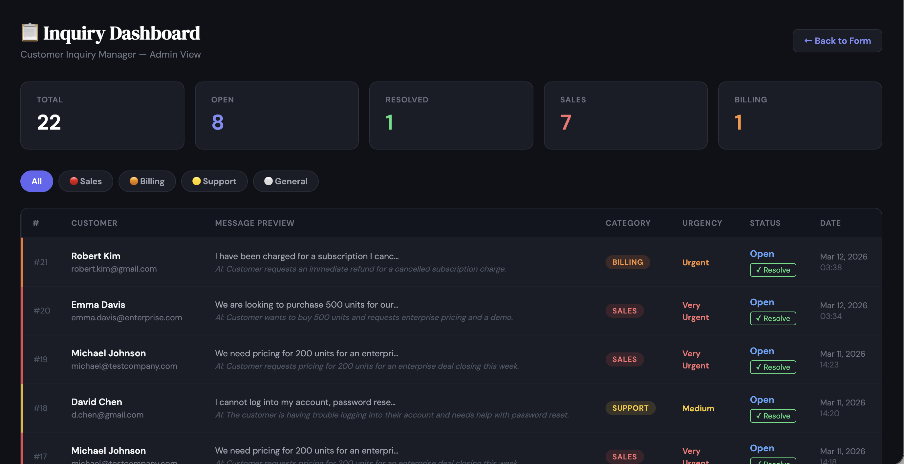
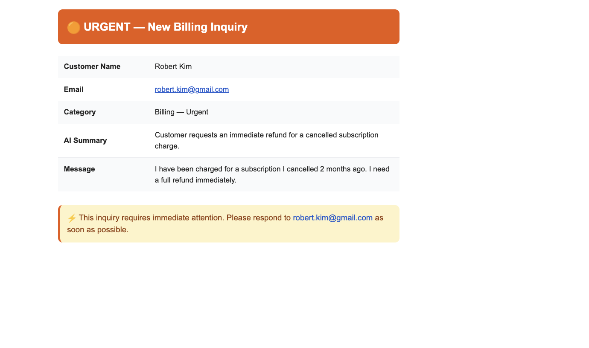
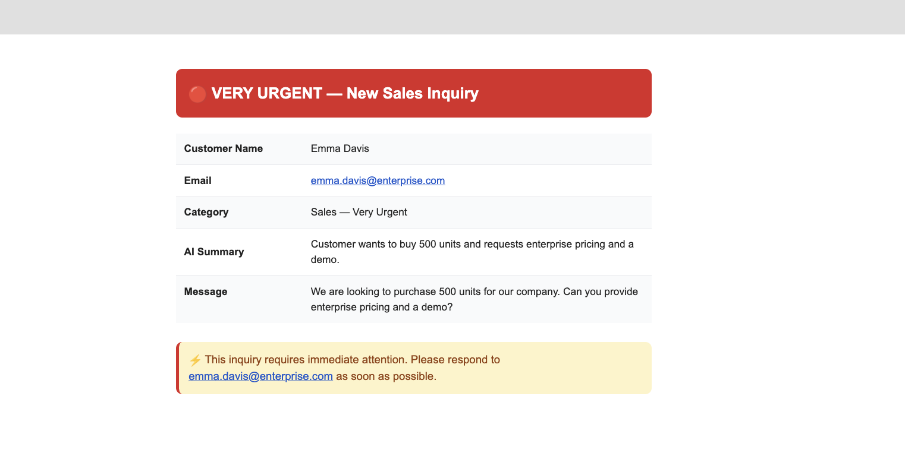

# Customer Inquiry Manager

An AI-powered customer inquiry management system built on Microsoft Azure as a 30-day cloud DevOps learning project.


---

## 🎯 What It Does

Customers submit inquiries through a web form. The system automatically:

- **Categorises** each inquiry as Sales, Billing, Support, or General using Azure OpenAI
- **Alerts** the business owner instantly for urgent Sales and Billing inquiries via email
- **Stores** all inquiries in Azure SQL with full customer and AI category data
- **Follows up** automatically with customers whose inquiries have been open 48+ hours
- **Summarises** all open inquiries in a daily email every morning at 8am
- **Tracks** status through an admin dashboard — Open → Follow-up Sent → Resolved

---

## 🏗️ Architecture

```
Customer
    │
    ▼
Nginx (Reverse Proxy)
    │
    ▼
Flask App (Gunicorn) ──────────► Azure SQL Database
    │                              (Customers, Inquiries,
    │                               AICategories)
    ├──────────────────────────► Azure OpenAI (gpt-4o-mini)
    │                              (Categorize & Summarize)
    │
    └──────────────────────────► SendGrid
                                   (Urgent Alerts)

Azure Functions (Serverless)
    ├── DailySummary   @ 8:00am ► SendGrid (Daily email)
    └── FollowupSender @ 8:05am ► Azure OpenAI → SendGrid → Azure SQL

Azure Monitor
    ├── CPU Alert      (>80% for 5 min)
    └── Heartbeat Alert (VM offline)
         └──────────────────────► Log Analytics Workspace
```

---

## ☁️ Azure Services Used

| Service | Purpose |
|---------|---------|
| Azure Virtual Machine (Ubuntu 22.04) | Hosts the Flask web application |
| Azure SQL Database (Serverless) | Stores customers, inquiries, AI categories |
| Azure OpenAI (gpt-4o-mini) | Categorises inquiries and generates follow-ups |
| Azure Functions (Consumption) | Serverless daily summary and follow-up automation |
| Azure Monitor | CPU and heartbeat alerts |
| Log Analytics Workspace | Centralised log storage and querying |

---

## 🛠️ Tech Stack

| Layer | Technology |
|-------|-----------|
| Web Framework | Python · Flask · Gunicorn |
| Web Server | Nginx (reverse proxy) |
| Database | Azure SQL · pyodbc · ODBC Driver 18 |
| AI | Azure OpenAI · gpt-4o-mini |
| Email | SendGrid |
| Serverless | Azure Functions v2 (Python) |
| Monitoring | Azure Monitor · Log Analytics |
| Version Control | Git · GitHub |

---

## 📁 Project Structure

```
customer-inquiry-manager/
├── app.py                  # Flask web application + admin dashboard
├── database.py             # Azure SQL database functions
├── ai_service.py           # Azure OpenAI categorisation + follow-up generation
├── notifications.py        # SendGrid email notification system
├── daily_summary.py        # Daily summary script (VM cron fallback)
├── requirements.txt        # Python dependencies
├── templates/
│   └── admin.html          # Admin dashboard UI
├── architecture.svg        # System architecture diagram
└── LESSONS_LEARNED.md      # Errors encountered and solutions (15+ entries)

customer-inquiry-functions/
├── function_app.py         # Azure Functions — DailySummary + FollowupSender
├── host.json
├── requirements.txt
└── local.settings.json     # Local dev only — never committed to GitHub
```

---

## 🔄 Full Request Flow

```
1.  Customer visits http://inquirymanager.me
2.  Nginx forwards request to Gunicorn on port 8000
3.  Flask renders the inquiry form
4.  Customer submits Name + Email + Message
5.  Flask saves customer to Azure SQL (or finds existing)
6.  Flask saves inquiry to Azure SQL (status: Open)
7.  Azure OpenAI categorises: Sales / Billing / Support / General
8.  AI result saved to AICategories table
9.  If Sales or Billing → SendGrid sends instant urgent alert to owner
10. Customer sees success message

Daily at 8:00am (Azure Functions):
11. DailySummary queries all unresolved inquiries from last 24h
12. Groups by category, formats HTML email, sends to owner

Daily at 8:05am (Azure Functions):
13. FollowupSender finds inquiries open 48+ hours
14. Azure OpenAI generates personalised follow-up for each
15. SendGrid emails follow-up directly to customer
16. Inquiry status updated to Follow-up Sent

Admin dashboard (/admin):
17. Admin logs in with username + password
18. Views all inquiries with colour-coded categories and urgency
19. Filters by category, marks inquiries as Resolved
```

---

## 🗃️ Database Schema

```sql
Customers
    id          INT IDENTITY PRIMARY KEY
    name        NVARCHAR(100)
    email       NVARCHAR(100) UNIQUE
    created_at  DATETIME DEFAULT GETDATE()

Inquiries
    id          INT IDENTITY PRIMARY KEY
    customer_id INT FOREIGN KEY → Customers.id
    message     NVARCHAR(MAX)
    status      NVARCHAR(50) DEFAULT 'Open'
    created_at  DATETIME DEFAULT GETDATE()

AICategories
    id            INT IDENTITY PRIMARY KEY
    inquiry_id    INT FOREIGN KEY → Inquiries.id
    category      NVARCHAR(50)       -- Sales | Billing | Support | General
    urgency_level NVARCHAR(50)       -- Very Urgent | Urgent | Medium | Low
    ai_summary    NVARCHAR(500)
    created_at    DATETIME DEFAULT GETDATE()
```

---

## 🔑 Environment Variables Required

Create a `.env` file locally (never commit this):

```
DB_SERVER=your-server.database.windows.net
DB_NAME=your-database-name
DB_USERNAME=your-sql-username
DB_PASSWORD=your-sql-password
AZURE_OPENAI_KEY=your-openai-key
AZURE_OPENAI_ENDPOINT=https://your-resource.openai.azure.com/
AZURE_OPENAI_DEPLOYMENT=your-deployment-name
SENDGRID_API_KEY=SG.your-sendgrid-key
SENDGRID_FROM_EMAIL=your-verified-sender@email.com
NOTIFICATION_EMAIL=alerts-recipient@email.com
SECRET_KEY=your-flask-secret-key
ADMIN_USERNAME=admin
ADMIN_PASSWORD=your-admin-password
```

---

## 🚀 Local Setup

```bash
# Clone the repo
git clone https://github.com/chandoopas/customer-inquiry-manager
cd customer-inquiry-manager

# Create virtual environment
python -m venv .venv
source .venv/bin/activate

# Install dependencies
pip install -r requirements.txt

# Create .env file with your credentials (see above)

# Run locally
python app.py
```

Visit `http://localhost:5000` for the inquiry form.
Visit `http://localhost:5000/admin` for the admin dashboard.

---

## 🖥️ VM Deployment

```bash
# SSH into VM
ssh azureuser@your-vm-ip

# Pull latest code
cd ~/customer-inquiry-manager
git pull

# Activate venv and install dependencies
source .venv/bin/activate
pip install -r requirements.txt

# Start Gunicorn
.venv/bin/gunicorn -w 2 -b 127.0.0.1:8000 app:app
```

---

## 🔒 Security

- All secrets stored in environment variables — never hardcoded
- `.env` excluded from Git via `.gitignore`
- Admin dashboard protected by Flask session login
- SSH restricted to specific IP via Azure NSG
- Azure SQL firewall restricts connections to VM IP and developer IP only
- Azure Function secrets stored in App Settings (encrypted)

---

## 📊 Monitoring

- **CPU Alert** — fires if VM CPU exceeds 80% for 5 consecutive minutes
- **Heartbeat Alert** — fires if VM stops sending heartbeat signals
- **Log Analytics** — all VM logs centralised and queryable
- **app.log** — every form submission, AI call, and email logged with timestamp
- **cron.log** — daily summary job execution logged

---

## 📖 Lessons Learned

See [LESSONS_LEARNED.md](LESSONS_LEARNED.md) for a full log of 15+ real errors encountered during this project and exactly how each was resolved. Topics include:

- Azure SQL firewall and connection troubleshooting
- Virtual environment and Gunicorn path issues
- Git secrets accidentally committed and removed
- Azure Functions environment variables and cron vs serverless
- Azure portal UI changes and deprecated tools

---

---

## 👨‍💻 Screenshots

### **Customer Inquiry Form**
Captures user data and inquiry details directly into the system.


---

### **Admin Login Page**
Secure access portal for administrative tasks and dashboard monitoring.


---

### **Inquiry Dashboard**
A high-level overview of daily inquiry trends and system status.


---
---
### **Daily Inquery Suumery**

---

### **Emails . Urgent**
Automated email alerts for standard urgent inquiries.


---

### **Emails . Very urgent**
High-priority alerts for critical customer inquiries requiring immediate action.


---

### **Customer Inquiry Database**
Centralized storage and management for all captured inquiry data.


---

### **System Monitoring**
**CPU Alerts:** Real-time monitoring of infrastructure performance.


---


**GitHub:** [@chandoopas](https://github.com/chandoopas)